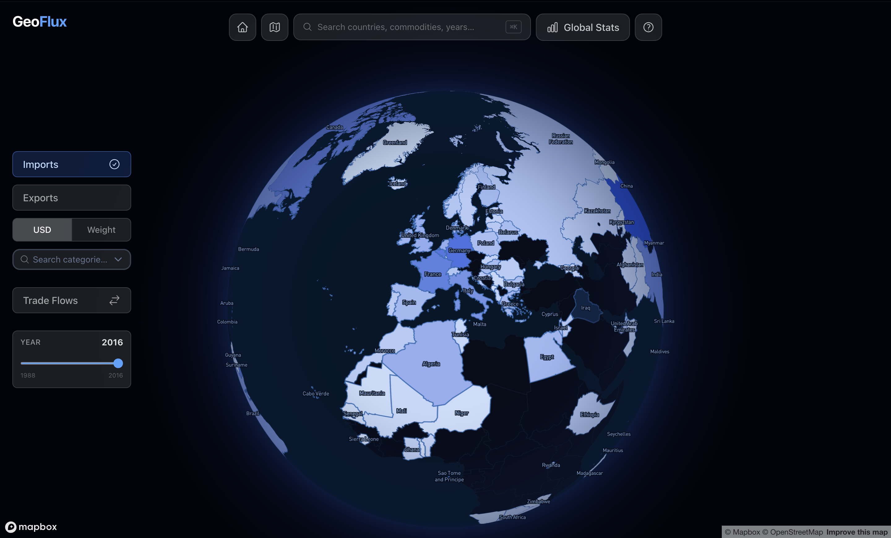

# GeoFlux — Visualizing 30 Years of Global Commodity Trade

> Course project of Data Visualization (COM-480 @ EPFL)

This repository contains a web app to visualize world trade flows from 1988 to 2016 using the [UN Comtrade Global Commodity Trade Statistics](https://www.kaggle.com/datasets/unitednations/global-commodity-trade-statistics) dataset. The app centers around an interactive 3D globe, allowing users to click on any country to view detailed trade statistics, explore import and export flows by category and year, and follow animated bilateral trade connections between countries. A search bar enables quick navigation to specific countries, categories, commodities or years.



## Screencast

A screencast demonstrating the key features of GeoFlux is available in the repository as `screencast.mp4`.

## Technical setup

This project is built using [Nuxt 4](https://nuxt.com), a full-stack development framework based on [Vue 3](https://vuejs.org). It relies on [Mapbox GL JS](https://www.mapbox.com) for globe rendering and [D3.js](https://d3js.org) for all chart components. Styling is handled with [Tailwind CSS v4](https://tailwindcss.com). The project is written in [TypeScript](https://www.typescriptlang.org).

The main layout is defined in `app/layouts/canvas.vue`, which manages the background globe and shared state. The root route (`/`) is handled by `app/pages/index.vue`, where the search bar, control panel and navigation buttons live. All detail views — countries, categories, commodities and years — are rendered as overlay windows from dedicated subpages within the `app/pages/` directory.

## Run instructions

### 1. Clone the repository locally

```sh
git clone https://github.com/com-480-data-visualization/geoflux.git geoflux
```

### 2. Set up your Mapbox token

Create a `.env` file at the root of the project and add your Mapbox public token:

```sh
NUXT_PUBLIC_MAPBOX_ACCESS_TOKEN=your_token_here
```

### 3. Install dependencies

```sh
npm install
```

### 4. Run the development server

```sh
npm run dev
```

The app will be available at `http://localhost:3000`.

## Process Book

The process book for this project can be found as `process-book.html` and `process-book.md` at the root of the repository. It details our journey from concept to final product, including design decisions, challenges faced, and individual team member contributions.

## Team

| Name | SCIPER |
| ---- | ------ |
| Coralie Banuls | 346654 |
| Jason Miller | 421814 |
| Jaime López | 423183 |
| Lucas Martiniano | 423438 |
